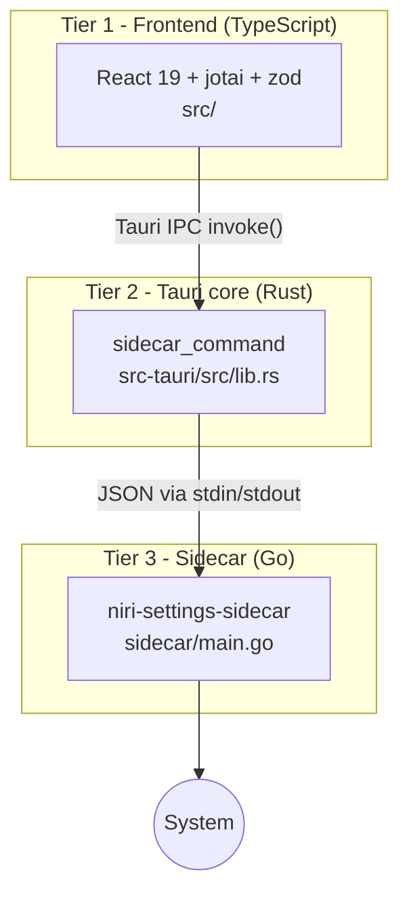

# 01 Architecture

Three tiers, strictly separated. Each tier only talks to its neighbour.



- **Frontend** owns all UI state (jotai atoms), validation (zod), and orchestration. It never touches the system directly.
- **Rust core** is deliberately thin: exactly **one** command, `sidecar_command` (`src-tauri/src/lib.rs:20`). It spawns the Go binary, pipes a JSON request to stdin, reads a JSON response from stdout.
- **Go sidecar** performs every privileged/system operation: `niri msg` IPC, file I/O, `gsettings`, `bash` scripts, quickshell reload. One process per request — stateless by design.

> [!tip] Why this shape?
> The sidecar isolates all system access in a language that is great at shelling out and parsing text (Go), keeps the Rust layer almost maintenance-free, and lets the frontend stay pure logic + views. Adding features = adding one switch-case in Go + one service function in TS.

## Directory map

| Path | Owner | Purpose |
|------|-------|---------|
| `src/components/layout/` | React | `AppLayout.tsx`, `Sidebar.tsx`, custom `TitleBar.tsx` (window has no native decorations) |
| `src/pages/` | React | One component per settings page: Wallpaper, Appearance, Icons, Display, Keybindings, Network, Sound, SysInfo |
| `src/stores/appAtoms.ts` | React | Navigation model: `PageId`, `SIDEBAR_SECTIONS`, `activePageAtom` |
| `src/lib/atoms.ts` | React | Settings state: `settingsAtom`, derived read-atoms, write-atoms with side effects |
| `src/lib/services.ts` | React | Typed wrappers around each sidecar command; never throw, return `null`/`false` on failure |
| `src/lib/sidecar.ts` | React | Generic `invoke()` plumbing: error normalization, zod validation |
| `src/lib/schemas.ts` | React | zod schemas — single source of truth for data shapes |
| `src/lib/logger.ts` | React | `logger` / `sidecarLogger` |
| `src-tauri/src/lib.rs` | Rust | The single IPC command + app builder |
| `src-tauri/capabilities/default.toml` | Rust | Permissions: `core:default`, `shell:allow-execute`, `shell:allow-spawn` |
| `sidecar/main.go` | Go | Command dispatcher (16 commands) |
| `sidecar/niri/` | Go | niri IPC parsing (`outputs.go`, `focused.go`, `keybindings.go`) |
| `sidecar/config/paths.go` | Go | XDG path resolution for `config.kdl` |
| `sidecar/system/commands.go` | Go | `ExecScript`, `ReloadQuickshell`, `SetGSetting` |

## IPC contract

Request written to the sidecar's **stdin**, response read from **stdout**, process exits:

```jsonc
// Request
{ "command": "write_settings", "args": { "content": "{ … }" } }

// Response — success
{ "ok": true, "data": { "status": "ok", "path": "/home/u/.config/dotfiles/settings.json" } }

// Response — failure
{ "ok": false, "error": { "code": "FILE_WRITE_ERROR", "message": "…", "details": null } }
```

Error codes are plain strings agreed between Go and TS (`NIRI_IPC_FAILED`, `PARSE_ERROR`, `INVALID_ARGS`, `FILE_WRITE_ERROR`, `SCHEMA_VALIDATION_ERROR`, …).

## Command registry

All dispatch lives in `sidecar/main.go` (`main()`, line 73):

| Command | Handler effect | Auto side effect |
|---|---|---|
| `list_outputs` | parse `niri msg outputs` | – |
| `focused_output` | parse `niri msg focused-output` | – |
| `reload_config` | `niri msg action reload-config` | – |
| `exec_script` | run string via `bash -c` | – |
| `reload_quickshell` | `qs ipc call settings reload` | – |
| `read_settings` | read `~/.config/dotfiles/settings.json` (missing → `{}`) | – |
| `write_settings` | write same file | quickshell reload |
| `read_niri_config` | read resolved `config.kdl` | – |
| `write_niri_config` | write `config.kdl` | niri reload |
| `validate_niri_config` | `niri validate --config <path>` | – |
| `read_keybindings` | parse keybind blocks from KDL | – |
| `write_keybinding` | edit binding in KDL | niri reload |
| `set_gsetting` | `gsettings set schema key value` | – |
| `read_file` / `write_file` | arbitrary path I/O | – |
| `open_file` | try `code → nvim → vim → nano → xdg-open` | – |

## Config locations

| What | Where | Resolved in |
|------|-------|-------------|
| App settings store | `~/.config/dotfiles/settings.json` | `sidecar/main.go` `handleReadSettings` |
| niri config | `$NIRI_CONFIG`, else `$XDG_CONFIG_HOME/niri/config.kdl`, else `~/.config/niri/config.kdl` | `sidecar/config/paths.go` `Resolve()` |

Next: [[02 Execution Flow]]
