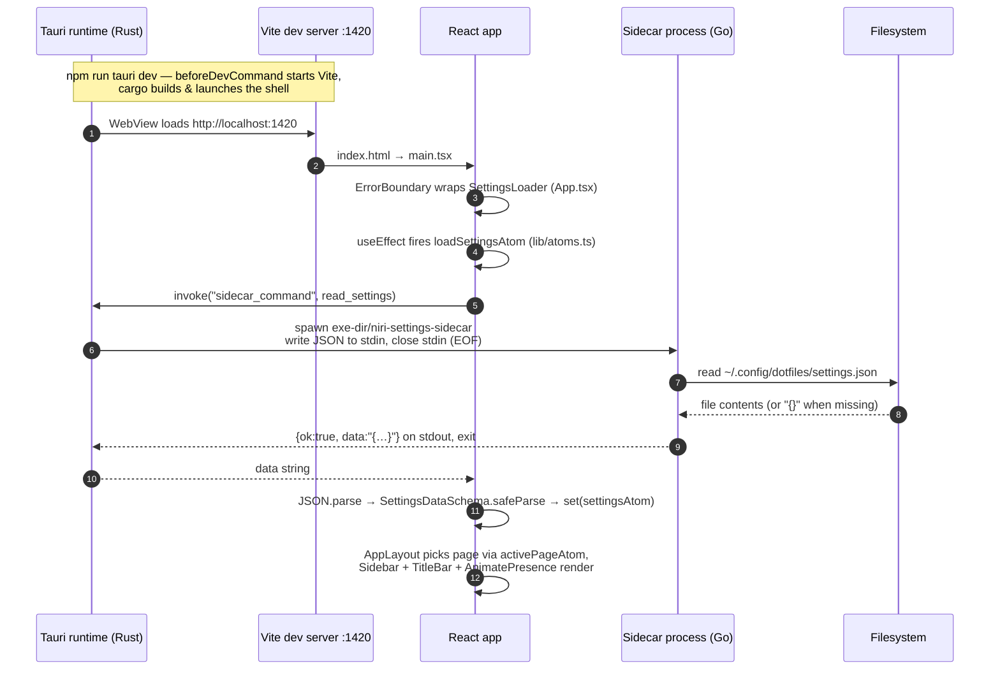
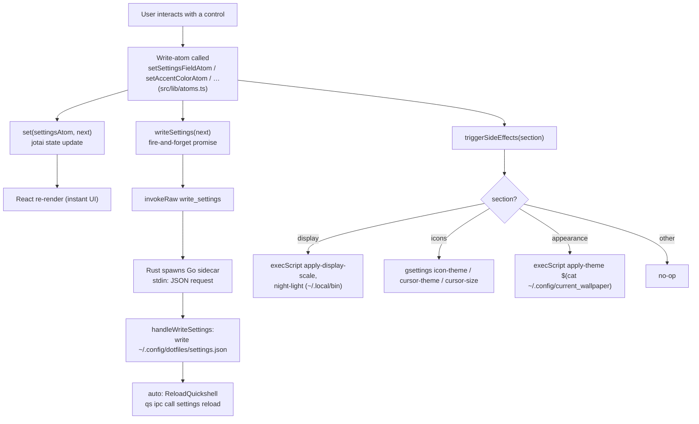
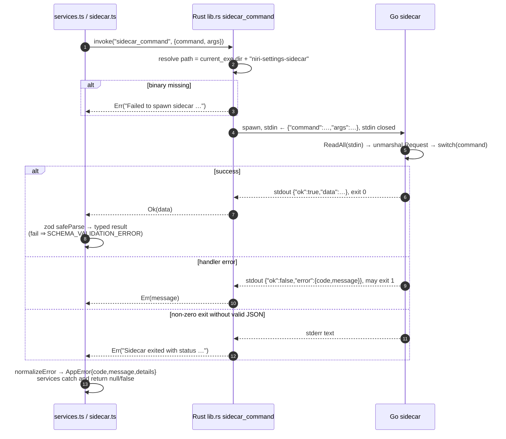
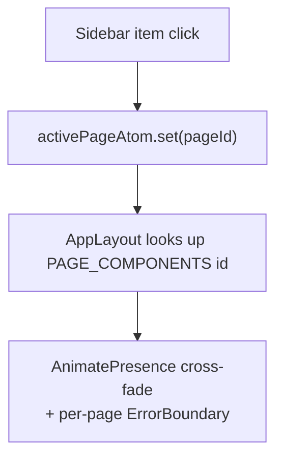

# 02 Execution Flow

All flows verified against the code (Aug 2026). Companion notes: [[01 Architecture]], [[03 Development Guide]].

## 1. App startup

Startup is **failure-tolerant**: if settings are unreadable or fail zod validation, `readSettings` returns `null` and defaults (`SettingsDataSchema.parse({})`) stay in place — the app still opens. But if the *sidecar binary itself* is missing, every command fails with `Failed to spawn sidecar`.

## 2. Settings change pipeline (the core loop)

Key properties:

- **Optimistic UI** — atoms update immediately; disk persistence is asynchronous ("fire-and-forget", errors only logged).
- **Persistence is centralised** in the write-atoms; pages/components never call services directly for saves.
- **Side effects** are keyed by settings section in one switch (`src/lib/atoms.ts`, `triggerSideEffects`).

## 3. Sidecar request lifecycle (protocol detail)

## 4. Page navigation

Trivial by design — no router library:

The registry lives in `src/components/layout/AppLayout.tsx` (`PAGE_COMPONENTS`); sidebar structure in `src/stores/appAtoms.ts` (`SIDEBAR_SECTIONS`). Adding a page = component in `src/pages/` + one entry in each map.
