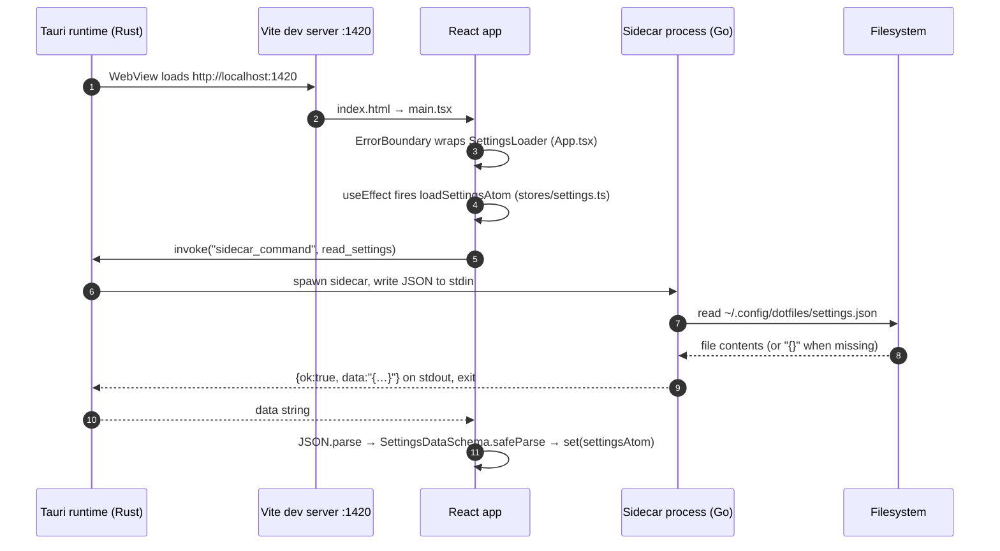
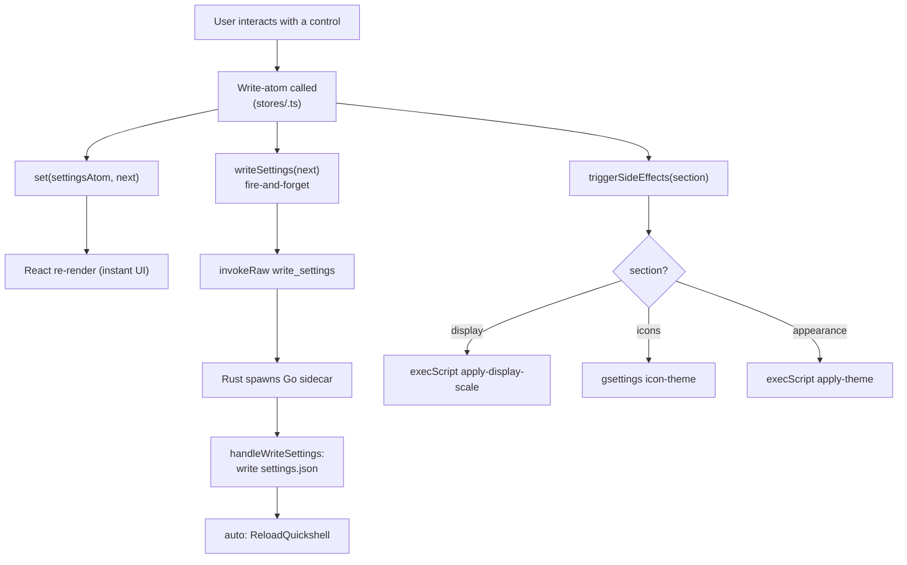
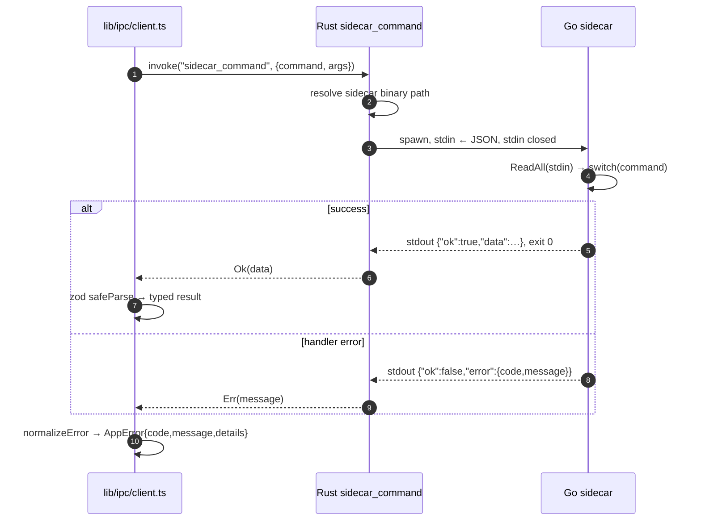

# 02 Execution Flow

## 1. App startup

Startup is failure-tolerant: if settings are unreadable or fail zod validation, `readSettings` returns `null` and defaults stay in place.

## 2. Settings change pipeline

Key: optimistic UI, persistence via write-atoms, side effects keyed by settings section.

## 3. Sidecar request lifecycle

## 4. Page navigation

No router library — `activePageAtom` + `PAGE_COMPONENTS` map in `AppLayout.tsx`.
