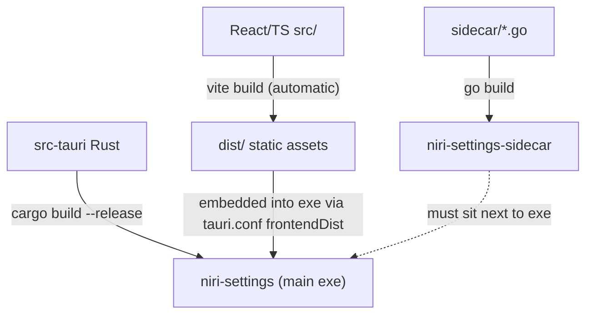

# 04 Building and Distribution

Goal: a **working executable** — meaning the app *plus* the Go sidecar next to it. Two binaries ship together; neither is useful alone.



## 1. Quick local build (works today)

```sh
cd ~/src/niri-settings

# ① full build: frontend (beforeBuildCommand) + cargo release compile
npm run tauri build

# ② build the optimized sidecar
go build -trimpath -ldflags "-s -w" -o src-tauri/binaries/niri-settings-sidecar-x86_64-unknown-linux-gnu ./sidecar

# ③ place it where the main binary looks for it
cp src-tauri/binaries/niri-settings-sidecar-x86_64-unknown-linux-gnu \
   src-tauri/target/release/niri-settings-sidecar

# ④ run
./src-tauri/target/release/niri-settings
```

> [!warning] Step ③ is required
> `tauri.conf.json` currently has **no `bundle.externalBin`**, so step ① does **not** package the Go helper. Skipping ③ yields an app that launches but fails on every action ("Failed to spawn sidecar").

## 2. Sidecar bundling — wired via `externalBin` (configured 2026-08-22)

`tauri.conf.json` now contains:

```jsonc
"bundle": {
    "active": true,
    "externalBin": ["binaries/niri-settings-sidecar"],
    "icon": [ … ]
}
```

The file produced in step ② follows Tauri's `<name>-<target-triple>` naming convention, so:

- `npm run tauri dev` and `npm run tauri build` copy & strip-suffix the sidecar automatically — step ③ of section 1 is no longer needed for bundling (you still rebuild the Go file after editing `sidecar/`, per step ②).
- Installers (`.deb`, `.rpm`, AppImage — whatever your host tooling produces) include the sidecar.
- `generate_context!` validates the binary exists at compile time: if cargo fails with a missing `binaries/niri-settings-sidecar-*`, run step ② first.

## 3. Artifacts produced by `tauri build`

| Artifact | Path | Notes |
|---|---|---|
| Main executable | `src-tauri/target/release/niri-settings` | embeds `dist/` frontend |
| Debian package | `src-tauri/target/release/bundle/deb/*.deb` | needs `dpkg-deb` |
| RPM | `…/bundle/rpm/*.rpm` | needs `rpmbuild` |
| AppImage | `…/bundle/appimage/*.AppImage` | downloads linuxdeploy on first run |

Install with e.g. `sudo apt install ./src-tauri/target/release/bundle/deb/niri-settings_0.1.0_amd64.deb`.

## 4. Runtime requirements on target machines

- Linux with Wayland (X11 fallback depends on webkit2gtk); built for niri but UI degrades gracefully elsewhere.
- `niri` CLI for display/keybinding pages; `gsettings`; optional quickshell daemon.
- User config appears at `~/.config/dotfiles/settings.json`; niri config path honours `$NIRI_CONFIG` / `$XDG_CONFIG_HOME` (`sidecar/config/paths.go`).

## 5. Release checklist

1. Bump version in both `package.json` and `src-tauri/tauri.conf.json` (+ `Cargo.toml` if you care).
2. `npm test && npm run lint && npm run typecheck`.
3. Full build per section 1 or 2; launch the artifact once and change a setting to prove the sidecar works from the installed location.
4. Commit the tag — remember the repo currently has no commits/history yet.
