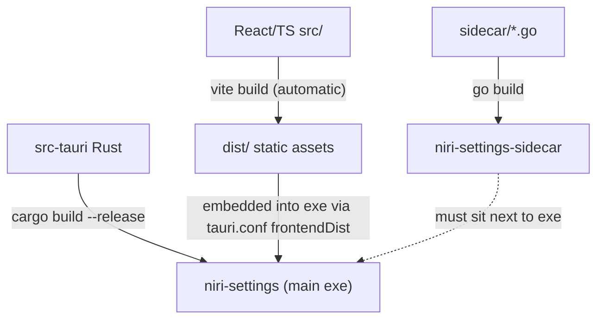

# 04 Building and Distribution

Goal: a **working executable** — meaning the app *plus* the Go sidecar next to it. Two binaries ship together; neither is useful alone.



## 1. Quick local build (works today)

```sh
cd ~/src/niri-settings

# ① full build: frontend (beforeBuildCommand) + cargo release compile
npm run tauri build

# ② build the optimized sidecar
go build -trimpath -ldflags "-s -w" -o src-tauri/binaries/niri-settings-sidecar-x86_64-unknown-linux-gnu ./sidecar

# ③ place it where the main binary looks for it
cp src-tauri/binaries/niri-settings-sidecar-x86_64-unknown-linux-gnu \
   src-tauri/target/release/niri-settings-sidecar

# ④ run
./src-tauri/target/release/niri-settings
```

> [!note] AppImage on Arch/CachyOS
> The linuxdeploy step needs `APPIMAGE_EXTRACT_AND_RUN=1` (fuse2 is not a default there):
> `APPIMAGE_EXTRACT_AND_RUN=1 NO_STRIP=true npx tauri build --bundles appimage`

## 1b. Full release pipeline (proven 2026-08-23)

```sh
# ① optimized sidecar → canonical externalBin path + target/release (for raw runs)
CGO_ENABLED=0 go build -trimpath -ldflags "-s -w" -o src-tauri/binaries/niri-settings-sidecar-x86_64-unknown-linux-gnu ./sidecar
cp src-tauri/binaries/niri-settings-sidecar-x86_64-unknown-linux-gnu \
   src-tauri/target/release/niri-settings-sidecar

# ② bundles: deb + rpm + appimage (see note above for the appimage env)
npx tauri build

# ③ portable tarball with install/uninstall scripts
./packaging/make-tarball.sh        # → release/niri-settings-<ver>-linux-x86_64.tar.gz

# ④ install user-local (no root) — desktop entry + hicolor icons included
tar -xzf release/niri-settings-*.tar.gz -C /tmp/pkg && /tmp/pkg/install.sh
```

**Parity verification** (run before shipping): pipe `{"command":"get_wallpaper_info","args":{}}`
through the debug (`binaries/`) and release sidecars and diff — only `wallpapers_by_mood`
seed names may differ (randomized per invocation by design). Then launch each artifact once
and confirm `[tauri:sidecar] Command '...' succeeded` log lines.

## 1c. Automated releases (CI)

`.github/workflows/release.yml` builds all four artifacts on GitHub Actions and attaches them
to a release:

- **Tag push** (`git tag v0.1.1 && git push origin v0.1.1`) → gates → sidecar + smoke test →
  AppImage/deb/rpm + tarball → GitHub Release with auto-generated notes.
  The tag must equal the version in `tauri.conf.json` or the run fails fast.
- **Manual dispatch** (`gh workflow run release`) → same build, artifacts uploaded to the
  workflow run instead of a release.

First CI run compiles the full Rust dep tree (~5–10 min); later runs reuse `rust-cache`.

## 2. Sidecar bundling — wired via `externalBin` (configured 2026-08-22)

`tauri.conf.json` now contains:

```jsonc
"bundle": {
    "active": true,
    "externalBin": ["binaries/niri-settings-sidecar"],
    "icon": [ … ]
}
```

The file produced in step ② follows Tauri's `<name>-<target-triple>` naming convention, so:

- `npm run tauri dev` and `npm run tauri build` copy & strip-suffix the sidecar automatically — step ③ of section 1 is no longer needed for bundling (you still rebuild the Go file after editing `sidecar/`, per step ②).
- Installers (`.deb`, `.rpm`, AppImage — whatever your host tooling produces) include the sidecar.
- `generate_context!` validates the binary exists at compile time: if cargo fails with a missing `binaries/niri-settings-sidecar-*`, run step ② first.

## 3. Artifacts produced by `tauri build`

| Artifact | Path | Notes |
|---|---|---|
| Main executable | `src-tauri/target/release/niri-settings` | embeds `dist/` frontend |
| Debian package | `src-tauri/target/release/bundle/deb/*.deb` | needs `dpkg-deb` |
| RPM | `…/bundle/rpm/*.rpm` | needs `rpmbuild` |
| AppImage | `…/bundle/appimage/*.AppImage` | downloads linuxdeploy on first run |

Install with e.g. `sudo apt install ./src-tauri/target/release/bundle/deb/niri-settings_0.1.0_amd64.deb`.

## 4. Runtime requirements on target machines

- Linux with Wayland (X11 fallback depends on webkit2gtk); built for niri but UI degrades gracefully elsewhere.
- `niri` CLI for display/keybinding pages; `gsettings`; optional quickshell daemon.
- User config appears at `~/.config/dotfiles/settings.json`; niri config path honours `$NIRI_CONFIG` / `$XDG_CONFIG_HOME` (`sidecar/config/paths.go`).

## 5. Release checklist

1. Bump version in `package.json`, `src-tauri/tauri.conf.json`, and `src-tauri/Cargo.toml`.
2. `npm test && npm run lint && npm run typecheck`.
3. Full pipeline per section 1b; run the parity check; launch the artifact and change a setting to prove the sidecar works from the installed location.
4. Artifacts land in `src-tauri/target/release/bundle/{deb,rpm,appimage}/` + `release/*.tar.gz` (gitignored).
